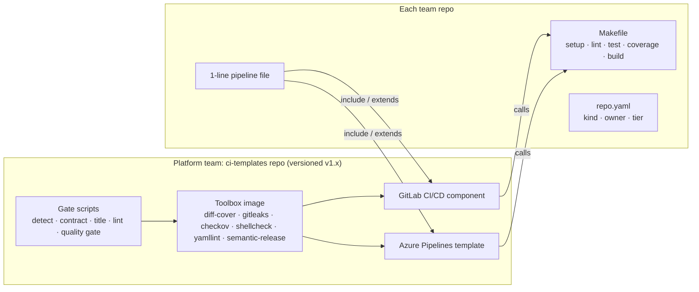

# Golden Pipeline: One Quality Standard for Every Repo

**Scope:** ~4,000 IT staff · GitLab + Azure DevOps · Go, Python, Java (Maven + Gradle), TypeScript/Node.js, Next.js, plus YAML/shell/IaC-only repos
**Status:** Proposal with a working reference implementation (`abralock/golden-pipeline-example`)

---

## 1. Executive summary

AI assistants now let every engineer produce much more code. Our current controls can't keep up with that volume. Many commits have no message and no work item, each repo builds and tests differently, and nobody can see which repos meet the quality bar.

The proposal: **one platform-owned "golden pipeline"** that every repo plugs into with a single line, on both GitLab and Azure DevOps.

- Teams keep full control of **how** they build (any language) through a standard `Makefile`.
- The platform team controls **what "good enough to release" means**, and those checks are automated, identical everywhere and hard to bypass.
- **At least 80% test coverage on new and changed code** is enforced on every merge request. Legacy code is not blocked, so overall coverage rises over time.
- Every change is traceable to a work item again, as it was in TFS.
- Repos that only hold YAML, shell or IaC skip the coverage check automatically, but are still scanned for secrets and misconfiguration.

---

## 2. The problem today

| Symptom | Impact |
|---|---|
| Commits without messages or work item links | No traceability from requirement → change → release; audit gaps |
| Every repo builds/tests differently | Can't compare quality; every onboarding is custom |
| No consistent coverage or test check | Untested code reaches production |
| YAML/shell/IaC repos mixed in with application code | "One rule for all" either blocks them or lets them skip everything |
| AI-generated code volume rising | Human review alone doesn't scale; AI can also write tests that assert nothing |
| Two CI platforms (GitLab + Azure DevOps) | Standards drift apart; double maintenance |

---

## 3. Design principles

1. **Teams own the "how", the platform owns "what counts".** A team decides how to run its tests. The platform decides what result is acceptable.
2. **The pipeline measures; it never takes the team's word for it.** The pipeline reads standard report files itself instead of accepting a pass/fail flag from the team's script.
3. **Only one place to change a rule.** The checks live in one repo and one container image, shared by GitLab and Azure DevOps.
4. **Detect, don't declare.** Whether a repo gets tested depends on which files it contains, not on a label a team could change to dodge the checks.
5. **Hold new code to the standard; don't punish legacy code.** Apply 80% to new and changed lines, and raise the whole-repo minimum gradually.
6. **Warn before blocking.** Every check can run in report-only mode during rollout.
7. **AI works on both sides**: it helps developers meet the standard and reviewers check it. The final pass/fail decision stays deterministic.

---

## 4. Architecture



**What the platform team owns**

| Component | Purpose |
|---|---|
| `scripts/` | The actual check logic; the same files run on both CI platforms |
| `toolbox/Dockerfile` | One pinned image with every check tool, pushed to both registries |
| `templates/golden-pipeline.yml` | GitLab CI/CD component (teams `include` it) |
| `azure/golden-pipeline.yml` | Azure Pipelines template (teams `extends` it) |
| `contract/Makefile.<stack>` | Starter Makefiles: `go`, `python`, `maven`, `gradle`, `node-ts`, `nextjs` |
| `policies/` | GitLab policy that forces the checks into every pipeline (phase 3) |

**What each team owns**

| File | Purpose |
|---|---|
| `Makefile` | Five fixed targets that hide the language-specific commands |
| `repo.yaml` | Repo type, owning team, criticality tier |
| `.gitlab-ci.yml` / `azure-pipelines.yml` | One include or extends line plus the team's own deploy steps |
| `AGENTS.md` | Coding standards that AI assistants read automatically |
| `CODEOWNERS` | Who must approve; the platform team must approve changes to the pipeline files |

---

## 5. The repo standards

### 5.1 Makefile contract, the same for every language

```make
setup:     # install dependencies
lint:      # static analysis, formatting, complexity limits
test:      # fast local test run
coverage:  # tests + reports/junit.xml + reports/coverage.xml
build:     # produce the deployable artifact in dist/
```

The pipeline never needs to know the language. It runs `make setup && make lint && make coverage` and then reads two report files in formats every major language can produce:

- **JUnit XML** for test results
- **Cobertura or JaCoCo XML** for coverage

How each of our stacks meets the contract. Every row has a working sample repo in `samples/`:

| Stack | Build image (example) | `make lint` | Test report | Coverage report |
|---|---|---|---|---|
| **Go** | `build-go:1.24` | gofmt, go vet (+ golangci-lint) | go-junit-report | gocover-cobertura → Cobertura |
| **Python** | `build-python:3.12` | ruff (incl. complexity rule C90) | pytest `--junitxml` | pytest-cov → Cobertura |
| **Java / Maven** | `build-java-maven:17` | Checkstyle (complexity ≤ 8) | Surefire XML | JaCoCo |
| **Java / Gradle** | `build-java-gradle:21` | Checkstyle (complexity ≤ 8) | Gradle test XML | JaCoCo |
| **TypeScript / Node.js** | `build-node:22` | ESLint (complexity ≤ 8) + `tsc --noEmit` | jest-junit | Jest (V8 provider) → Cobertura |
| **Next.js** | `build-node:22` | ESLint (next config, complexity ≤ 8) + `tsc` | jest-junit | Jest via `next/jest` (V8) → Cobertura |

**Two Java versions?** The JDK version comes from the build image (e.g. JDK 17 for Maven services, JDK 21 for Gradle services). The Makefile and the checks stay the same; Java teams only set `coverage_format: jacoco`.

**Next.js:** business logic goes in `lib/` and UI in `components/`, and both are unit-tested and counted toward the 80%. Thin `app/` route files are covered by E2E tests (Playwright), which run separately. Which files count toward coverage (`collectCoverageFrom` in `jest.config.js`) is protected by CODEOWNERS, so a team can't quietly exclude its hard-to-test files.

### 5.2 `repo.yaml`

```yaml
kind: service        # service | library | iac | scripts | config
owner: team-pricing
tier: 1              # 1 = customer-facing prod, 2 = internal, 3 = tooling
```

This file feeds the repo inventory and dashboards. It **cannot** be used to skip tests. If a repo declares `iac` but contains a `pom.xml`, `package.json` or similar build file, the pipeline fails.

### 5.3 Commit messages and work items

- **Merges are squashed**, so the MR/PR title becomes the one commit message on `main`.
- Title format: `<type>(<scope>): <summary> <work item>`
  - `feat(payment): add refund API AB#12345`
  - `fix: null check on customer lookup PAY-812`
- **Old history is not rewritten.** The rule applies from now on.
- The same titles drive **automatic versioning**: `feat` bumps the minor version, `fix` bumps the patch, and `!` marks a breaking change that bumps the major. A git tag `vX.Y.Z` plus release notes are created on every merge to main.

> **Git tags** are used for release versions only, never to classify repos.

---

## 6. Pipeline walkthrough

| Stage | Job | Runs for | Blocks when |
|---|---|---|---|
| validate | detect-profile | all repos | `repo.yaml` tries to opt a code repo out of testing |
| validate | mr-title | MR/PR | title lacks the type prefix or a work item ID |
| validate | static-lint | **all repos** | secret found; shellcheck/yamllint/checkov failure |
| validate | contract | code repos | a Makefile target is missing or empty |
| test | unit-test | code repos | lint or tests fail |
| quality | quality-gate | code repos | 0 tests · any failure · below the whole-repo minimum · **< 80% on new lines** |
| build | build | code, `main` only | `make build` fails |
| release | release | `main` only | (creates the version tag) |
| deploy | team stages | `main` only | the platform forces the condition; teams can't override it |

### What a team writes on GitLab

```yaml
include:
  - component: $CI_SERVER_FQDN/platform/ci-templates/golden-pipeline@1.0.0
    inputs:
      build_image: registry.corp.example/platform/build-python:3.12
      min_overall_coverage: 80
```

### What a team writes on Azure DevOps

```yaml
resources:
  repositories:
    - repository: templates
      type: git
      name: Platform/ci-templates
      ref: refs/tags/v1.0.0
extends:
  template: azure/golden-pipeline.yml@templates
  parameters:
    buildImage: corpacr.azurecr.io/platform/build-python:3.12
    deployStages: [ ...team deploy stages... ]
```

---

## 7. Why "80% on new code" instead of "80% overall"

Measured on the reference implementation. A developer adds new code **without tests** in a merge request:

| Stack | Change | Overall coverage | New-code coverage | Result |
|---|---|---|---|---|
| Python | new `CouponDiscount` class | **87.8%** | **37%** | ❌ Blocked |
| Go | new `Bulk()` function | 71% | **0%** | ❌ Blocked |
| TypeScript | new `CouponDiscount` class | 81% | **20%** | ❌ Blocked |
| Python | same change **with tests** | 100% | 100% | ✅ Pass |

An "80% overall" rule would have **let the untested code through**, because the old, well-tested code hides it. Checking new code:

- blocks untested changes no matter how good the old code is,
- doesn't block teams with legacy code at 20% coverage, and
- raises overall coverage naturally over time, because every change adds tested code.

Legacy repos start with a whole-repo minimum at today's value. It's raised each quarter and never lowered.

### Lesson from testing: a check can fail silently

In the TypeScript sample, Jest's default coverage engine (with ts-jest and TypeScript 6) wrote **broken file paths** into the report. The new-code check then found "no coverage information" and **passed an MR it should have blocked**. Two fixes:

- The samples use Jest's V8 coverage provider, which writes correct paths.
- `quality_gate.py` now **fails** when the report's file paths don't match files in the repo, so a tool quirk in any language can't silently turn the check off.

This is why the platform team, not each team, owns the check logic: one fix protects every repo.

### Coverage is not quality

AI can easily write tests that execute code without checking anything. Mitigations:

- The check fails if **0 tests ran** or the test target is empty.
- `AGENTS.md` tells AI tools: every test must assert behaviour.
- **Mutation testing** (PIT, Stryker, mutmut) on tier-1 services, sampled weekly, measures whether tests actually catch bugs.
- **Human code-owner approval** stays mandatory.

### SOLID principles, measured indirectly

SOLID can't be measured directly. We measure what tends to go wrong when it's ignored:

- **Cyclomatic/cognitive complexity limits** in `make lint` (e.g., max 8 per function)
- **Architecture tests** (ArchUnit, NetArchTest, dependency-cruiser) to enforce layering
- Duplication and code-size metrics (optional SonarQube)
- An **AI reviewer** on each MR checks against the design rules in `AGENTS.md`; a human approves

---

## 8. YAML, shell and IaC-only repos

No opt-out is needed. The pipeline sees that the repo has no build files and **doesn't create** the contract, unit-test, coverage and build jobs. These repos still get:

| Check | Tool |
|---|---|
| Secrets | gitleaks |
| Shell scripts | shellcheck |
| YAML syntax/style | yamllint |
| Terraform / Bicep / Helm / K8s / Dockerfile security | checkov |
| Versioned releases | semantic-release tag |

**Exceptions are written inline with a reason**, so they're visible in review and in audits:

```hcl
#checkov:skip=CKV2_AZURE_1:Log data classified Internal; Microsoft-managed keys approved (SEC-EX-2291)
```

In the reference repo, checkov found 7 findings. 4 were fixed and 3 were documented as exceptions, and the repo then passed.

---

## 9. AI across the development lifecycle

| Stage | How AI helps | Control that stays deterministic |
|---|---|---|
| Writing code | Assistants read `AGENTS.md` (standards, complexity, "no test without assertions") | `make lint` |
| Writing tests | AI generates unit tests for new code | 80% new-code coverage + mutation testing |
| Commit / MR | AI drafts the MR title and description with the work item | Title-format check |
| Review | AI reviewer does a first pass against the checklist | Human CODEOWNERS approval |
| Dependencies | AI suggests packages | Internal package proxy only + dependency scanning |
| Release | AI summarises release notes | semantic-release from commit titles |

**Rule:** AI can suggest and assist, but only the automated checks and humans can approve a merge.

---

## 10. Enforcement: making the checks mandatory

| | GitLab | Azure DevOps |
|---|---|---|
| Merge rules | "Pipelines must succeed", squash merge, protected `main` | Branch policy: require PR, **squash only**, build validation |
| Work item link | MR title check | **"Check for linked work items"** policy + title check |
| Approvals | MR approvals + CODEOWNERS | Required reviewers + code owners |
| Can't remove the checks | **Pipeline execution policy** (Ultimate tier) | **"Required template" check** on prod environments |
| Deploy protection | Protected environments | Environment approvals; the template forces deploys to be main-only |
| Pipeline file changes | CODEOWNERS → platform approval | Same |

---

## 11. Rollout plan (proposed)

| Phase | When | What | Blocks merges? |
|---|---|---|---|
| **0. Build & pilot** | Month 1 | Publish toolbox image, templates and build images; onboard one volunteer team per stack (Go, Python, Java Maven, Java Gradle, Node/TS, Next.js, IaC) | Pilot only |
| **1. Warn mode** | Months 2–3 | All repos with commits in the last 90 days include the pipeline with `mode: warn`; publish per-team results | No |
| **2. Enforce tier 1** | Month 4 | `mode: enforce` for customer-facing services; new-code 80% active | Tier 1 |
| **3. Enforce all + lock** | Months 5–6 | All tiers enforced; GitLab policy and Azure Required-template checks switched on | All |
| **4. Ratchet** | Quarterly | Raise whole-repo minimums; add mutation testing to tier 1 | — |

Only active repos are included. Dormant repos are archived or onboarded when they're next touched.

### KPIs

- % of active repos onboarded (target 100% by month 6)
- % of MRs with a valid work item (target > 98%)
- Pass rate of the checks on first try, and median new-code coverage
- Secrets caught before merge
- DORA: change failure rate, lead time for changes

---

## 12. Decisions needed from leadership

1. **Approve the standard:** 80% coverage on new code; conventional MR titles with a work item; squash merges.
2. **Platform team capacity:** an estimated 3–4 engineers to own the templates and image and to support onboarding.
3. **Licensing:** GitLab Ultimate (or an equivalent control) for the policy that forces the checks into every pipeline; optionally SonarQube for dashboards.
4. **Exception process:** who can approve a temporary waiver, and for how long (suggested: architect sign-off, 90-day expiry).
5. **Cut-over dates** for phases 2 and 3.

---

## 13. Risks and mitigations

| Risk | Mitigation |
|---|---|
| Teams see it as bureaucracy | Warn mode first; one-line onboarding; starter Makefiles; visible benefit (auto versioning, MR coverage view) |
| Coverage gaming with empty tests | Zero-test check; mutation testing; human review |
| Coverage tool quirk makes a check pass silently | Check fails if report paths don't match repo files; platform fixes once for everyone |
| Blocked public registries (Go proxy, Maven Central, npm) | Build images point GOPROXY, Maven/Gradle and npm/pip at Artifactory/Nexus |
| Tool versions drift (e.g. ESLint 10 vs Next.js plugins, TypeScript 7) | Platform maintains tested versions in the starter Makefiles and samples |
| Pipeline change breaks 1,000s of repos | Templates are versioned; teams pin `@1.0.0`; canary rollout to pilot teams |
| Security scan noise on day 1 | Documented inline exceptions; warn mode; tune baseline rules centrally |
| Two CI platforms drift | All logic in shared scripts + one image; templates are thin wrappers |

---

## 14. Reference implementation status

**Verified in the sandbox, per stack:**

| Sample | lint | tests | coverage | check | build |
|---|---|---|---|---|---|
| Go 1.24 | ✅ | ✅ 10 | 83.9% | ✅ | ✅ binary runs |
| Python 3.12 | ✅ | ✅ 7 | 100% | ✅ | ✅ wheel |
| TypeScript / Node 22 | ✅ | ✅ 6 | 100% | ✅ | ✅ dist/ |
| Next.js 16 | ✅ | ✅ 8 | 100% | ✅ | ✅ standalone server serves the page |
| Java 17 / Maven | compiled ✅ | compiled ✅ | – | JaCoCo parsing ✅ | – |
| Java 21 / Gradle | compiled ✅ | compiled ✅ | – | JaCoCo parsing ✅ | – |
| Terraform + shell | ✅ | – | – | ✅ | – |

Also verified: the contract check (including a target that exists in name only), MR title check, warn mode, the "declare iac to skip tests" attempt, a planted secret being caught, and yamllint/shellcheck on all platform files.

**To validate in the corporate environment:**

- Java builds end to end (the sandbox couldn't reach Maven Central; use your Artifactory/Nexus mirror)
- Toolbox and build images (behind the corporate proxy and mirrors)
- GitLab component and Azure template on real runners and agents
- GitLab pipeline execution policy syntax for your GitLab version
- semantic-release on Azure Repos (the Build Service account needs Contribute + Create tag)

---

## 15. FAQ

**Do we need SonarQube?** No, the checks run without it. It's useful as a dashboard and for duplication and complexity metrics across 1,000s of repos.

**Why a Makefile and not a GitLab/Azure-specific script?** It works for every language, runs the same on a laptop as in CI, and outlives any single CI platform.

**Can a team lower the 80%?** No. `min_new_coverage` is set by the platform, and changes to pipeline files need platform approval through CODEOWNERS.

**We have Java on two versions. Do they need different pipelines?** No. The JDK comes from the build image (`build-java-maven:17`, `build-java-gradle:21`, …). Maven and Gradle each have a starter Makefile, and both produce the same JaCoCo report.

**Does E2E testing (Playwright/Cypress) count toward the 80%?** No. The 80% rule is for unit tests, which are fast and run on every MR. E2E tests are encouraged and can run as a separate job, but they don't replace unit tests for `lib/` and `components/`.

**What about monorepos?** They use the same contract: the root Makefile delegates to each module, and all modules' reports are merged into `reports/`.

**What about repos with no tests at all today?** They go through warn mode. After cut-over, only *new* code needs tests, so existing code doesn't have to be retrofitted all at once.
